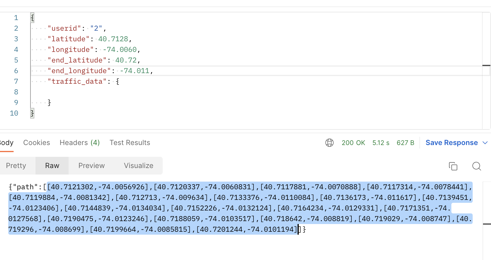
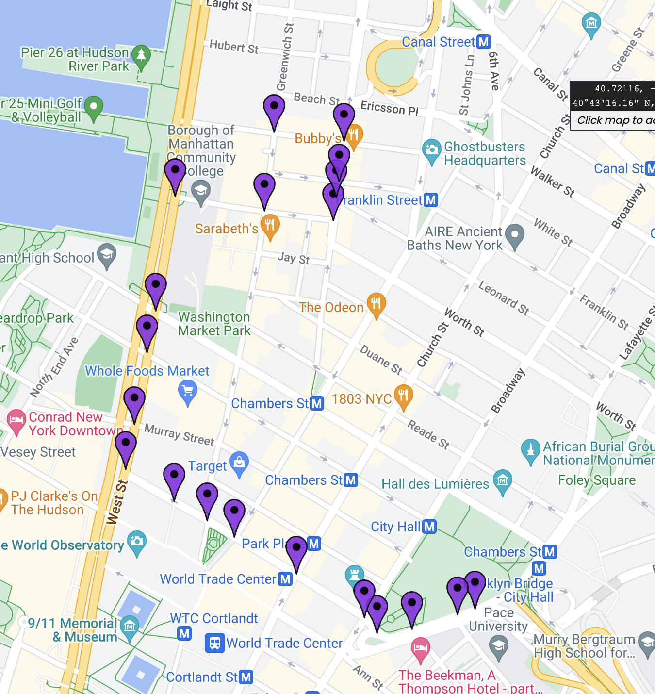
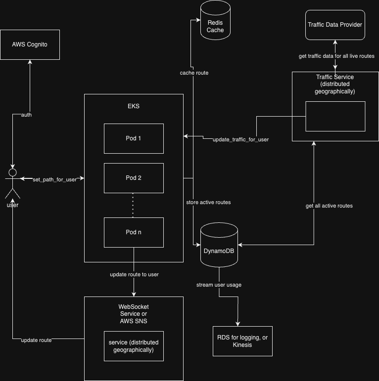

### Usage:
(Tested using python 3.11.4 and MacOS 13.4 [M1 Max MBP w/ 1TB SSD & 32GB RAM])
- Run: `docker-compose up --build` OR (if built) `docker-compose up`
- Run tests: `(from main dir: python -m unittest discover` OR `docker-compose up test)`

Example Response from set_path:

Illustrated:

---
### To do (make production-ready):
- k8s yaml for load-balancing deployment
- more performance testing
- memory leak tests
---
### Discussion:
Data Gathering and Management:

For data gathering, we could use a combination of third-party data sources like HERE or Waze, which provide real-time traffic data, and user reports from within the application. The data received would be a mixture of structured data (like GPS coordinates, timestamps) and unstructured data (like user comments or feedback).

We can employ AWS S3 for long-term data storage and AWS DynamoDB for low latency data access required by our routing algorithms. AWS Glue can be utilized for ETL jobs to clean and prepare the data. For user-generated reports, a real-time processing system like AWS Kinesis can be used to ingest and process data.

Routing Algorithm:

Our routing algorithm would be based on Dijkstra's or the A* algorithm, which are common choices for path-finding. In the sample code provided we opted for Dijkstra for simplicity. I actually came across an interesting repo on Github where the author used a combination of A* and stochastic methods to optimize the path (https://github.com/mehrdadn/SOTA-Py). We would need to adjust the weights used in these algorithms to account for traffic and other dynamic factors. This could be done by increasing the 'cost' associated with roads that have heavy traffic or are closed.

Real-Time Updates:

For real-time updates, AWS Lambda (serverless function) can be triggered on changes in traffic data (e.g., from Kinesis or DynamoDB Streams), which would re-calculate affected routes. A publish-subscribe system such as AWS SNS (Simple Notification Service) could be used to push these updates to the users' devices in real-time.

Scalability:

To handle a large number of users and route calculations, we can make use of AWS Elastic Beanstalk or ECS (Elastic Container Service) or EKS for deploying our service, allowing us to automatically scale up or down based on demand. Caching with AWS ElastiCache or Redis (provided in this proof of concept) can be used for common routes to reduce computation. Computationally intensive tasks can be offloaded to distributed computing systems like AWS Batch.
One issue I see is our declaration of the websocket provider within this proof of concept code - this may need to be extracted to a separate callable service (protected by VPC) that can send updates to the UI.

User Interface:

Although this is mainly a backend question, the user interface would need to clearly show the calculated route, alternatives, and provide turn-by-turn directions. AWS Amplify (React or React-Native for iOS/Android) can be used to rapidly prototype and deploy user interfaces. We could also stick to Swift/Kotlin for native development but this would require more development effort. The updates can be streamed to the user via websockets in the case of traffic alerts.

Reliability and Redundancy:

AWS services inherently provide redundancy. Multi-AZ deployment can be used to ensure high availability and fault tolerance. We can use AWS Backup for backing up our data in S3 and DynamoDB.

Security and Privacy:

AWS Cognito can be used to manage user authentication and provide temporary, limited-privilege credentials to access AWS resources. Data transmitted can be encrypted using SSL/TLS, and at-rest encryption can be used for data stored in S3 or DynamoDB. We should anonymize sensitive data wherever possible, and regular audits can be conducted using AWS Config and CloudTrail.

This architecture provides a scalable and reliable solution for real-time traffic routing, while considering user privacy and data security.

---
### Rough sketch of System Architecture:

